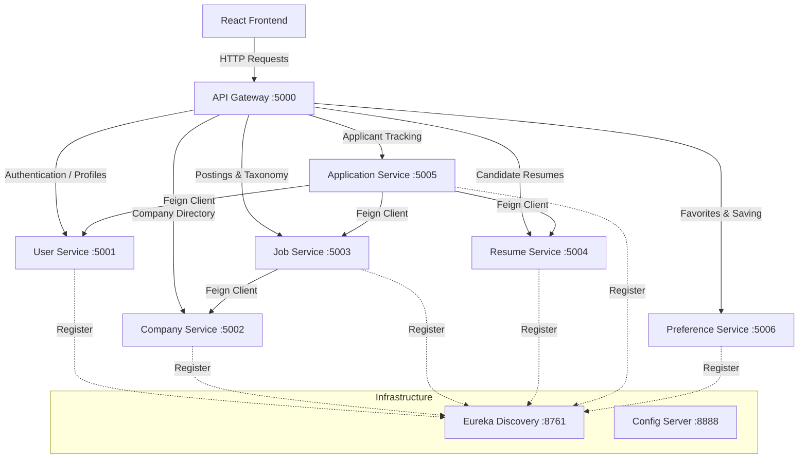

# Noir Job Portal — Cloud-Native Microservices Architecture

Noir Job Portal is a highly scalable, enterprise-grade job search, recruitment, and applicant tracking system built using a Spring Cloud microservices backend and a React frontend.

---

## 🏗️ Architecture & Component Topology

The system is decoupled into functional microservices communicating via HTTP/REST, registered with **Netflix Eureka**, and routed through an **API Gateway** with built-in JWT security checks.



---

## 📁 Repository Structure

```directory
├── cloud/                             # Cloud Infrastructure Modules
│   ├── job-portal-api-gateway/        # Port 5000: Gateway routing & JWT checks
│   ├── job-portal-config-server/     # Port 8888: Central Spring Cloud Config
│   └── job-portal-registry-service/   # Port 8761: Service registry (Eureka)
├── services/                          # Business Microservices
│   ├── job-portal-user-service/       # Port 5001: Profile and Authentication
│   ├── job-portal-company-service/    # Port 5002: Company listings
│   ├── job-portal-job-service/        # Port 5003: Job postings & Categories
│   ├── job-portal-resume-service/     # Port 5004: PDF Resume data profiles
│   ├── job-portal-application-service/# Port 5005: Job application records
│   └── job-portal-preferences/        # Port 5006: User saved jobs
├── common-lib/                        # Shared libraries (DTOs, domain models)
├── config-repo/                       # Config server profiles (properties, YAMLs)
├── frontend/                          # React + Vite frontend application
└── job-portal-endpoints.json          # Postman Collection JSON export
```

---

## ⚡ Tech Stack

* **Backend Framework**: Spring Boot 3.x, Spring Cloud 2023.x
* **Database**: PostgreSQL (per-service datasource isolation)
* **Client Networking**: Spring Cloud OpenFeign
* **Security & Routing**: Spring Cloud Gateway MVC, JWT (JSON Web Tokens)
* **Service Discovery**: Netflix Eureka
* **Frontend**: React.js (Vite), Axios, Tailwind CSS
* **Build System**: Maven (Reactor Multi-Module)

---

## 🚀 Getting Started

### 📋 Prerequisites
* **Java**: SDK 21 or higher
* **Database**: PostgreSQL database server
* **Build Tools**: Maven 3.9+
* **Package Manager**: Node.js & npm

### ⚙️ Database Configuration
Ensure you have created the respective PostgreSQL databases for your services:
* `job_portal_user`
* `job_portal_company`
* `job_portal_job`
* `job_portal_resume`
* `job_portal_application`
* `job_portal_preference`

Configure database credentials in the central files inside [`config-repo/`](file:///c:/Users/vikas%20prajapati/Downloads/full%20stack%20projects/job-portal-system/config-repo).

---

### ⏱️ Service Startup Sequence
To ensure smooth inter-service communication, boot the modules in this sequence:

1. **Service Registry**:
   * Navigate to [`cloud/job-portal-registry-service`](file:///c:/Users/vikas%20prajapati/Downloads/full%20stack%20projects/job-portal-system/cloud/job-portal-registry-service) and run `mvn spring-boot:run`.
   * Monitor discovery status at: `http://localhost:8761`

2. **Config Server**:
   * Navigate to [`cloud/job-portal-config-server`](file:///c:/Users/vikas%20prajapati/Downloads/full%20stack%20projects/job-portal-system/cloud/job-portal-config-server) and run `mvn spring-boot:run`.
   * Test configurations via: `http://localhost:8888/application/default`

3. **Core Microservices** (can be booted concurrently):
   * Run `mvn spring-boot:run` in each folder inside `services/`.
   * Confirm registration in the Eureka dashboard (`http://localhost:8761`).

4. **API Gateway**:
   * Navigate to [`cloud/job-portal-api-gateway`](file:///c:/Users/vikas%20prajapati/Downloads/full%20stack%20projects/job-portal-system/cloud/job-portal-api-gateway) and run `mvn spring-boot:run`.
   * The gateway will route endpoints on port **`5000`**.

5. **Frontend**:
   * Navigate to [`frontend`](file:///c:/Users/vikas%20prajapati/Downloads/full%20stack%20projects/job-portal-system/frontend), run `npm install` followed by `npm run dev`.

---

## 📬 API testing & Postman

Import the built-in [`job-portal-endpoints.json`](file:///c:/Users/vikas%20prajapati/Downloads/full%20stack%20projects/job-portal-system/job-portal-endpoints.json) file directly into Postman to load all endpoints preconfigured to point to the Gateway Port `5000`.
