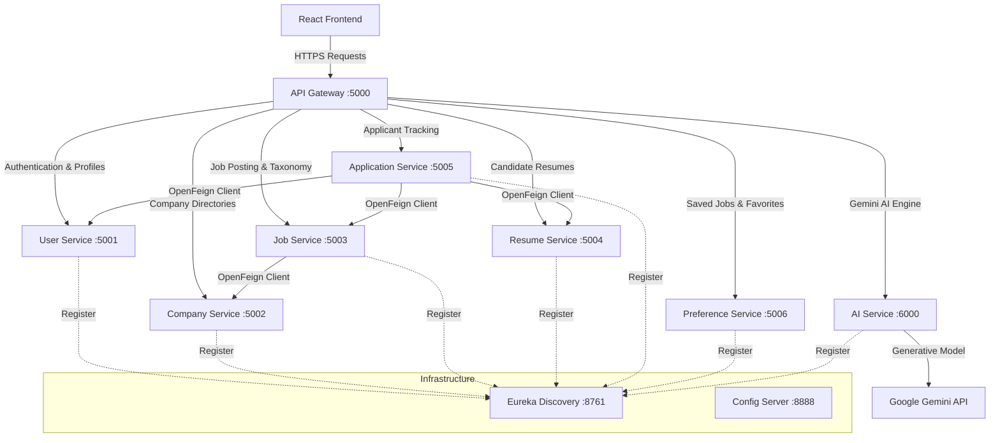
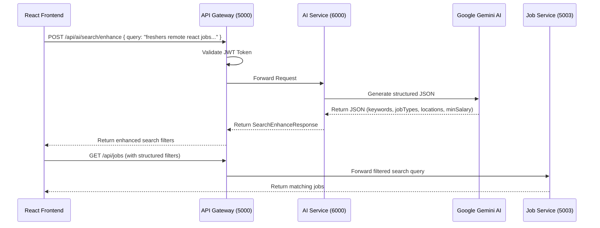

# Noir Job Portal — Cloud-Native Microservices Architecture

Noir Job Portal is a highly scalable, enterprise-grade job search, recruitment, and applicant tracking system. It is powered by a multi-module **Spring Cloud microservices backend** integrated with **Google Gemini AI** for intelligent recruitment tools, and a fluid, responsive **React frontend**.

---

## 🏗️ System Architecture & Component Topology

The system is fully decoupled into functional microservices communicating via stateless REST APIs. Services register themselves with **Netflix Eureka** for discovery and route traffic through an **API Gateway** which handles unified JWT-based security validation.



---

## 🤖 Deep AI Integrations & Features

The [`job-portal-ai-service`](file:///c:/Users/vikas%20prajapati/Downloads/full%20stack%20projects/job-portal-system/services/job-portal-ai-service) is integrated with **Google Gemini** using Spring REST Clients to supply cognitive intelligence across 5 modules:

### 1. General Career Chatbot
* **Noir Assistant**: A restricted conversational AI bot that guides users on career choices, resumes, and interview preparation while filtering out unrelated questions (e.g. politics).

### 2. Resume AI Engine
* **Professional Summary Generator**: Creates targeted resumes using candidate work history and target job descriptions.
* **ATS Experience Optimizer**: Re-writes bullet points starting with strong action verbs and quantitative metrics.
* **Resume Parser**: Extracts structured JSON data (skills, experience, education) from raw text.
* **Resume Auditor**: Evaluates gaps and offers feedback based on candidate targets.

### 3. Smart Job Posting Auto-fill
* **Job Description Builder**: Generates markdown job descriptions based on target skills and levels.
* **Compensation Benchmarker**: Predicts realistic local market salary ranges based on current Indian market trends.
* **Taxonomy Auto-Suggest**: Recommends skills and SEO search tags to recruiters creating jobs.

### 4. Application Screening AI
* **Cover Letter Generator**: Drafts 3-paragraph, company-specific cover letters using candidate profiles.
* **Candidate Screening Score**: Computes compatibility match score (0-100) comparing resumes to requirements.
* **Skills Gap Analyzer**: Highlights missing skills for a job posting and recommends specific learning plans.

### 5. Semantic Search Enhancement
* **Natural Language Search Parser**: Converts queries like *"freshers remote react jobs paying at least 8 LPA"* into structured filters (location, skills, minSalary, experience level).

---

## 🔄 Search Enhancement Data Flow

Here is how the system handles natural language job searching end-to-end:



---

## ⚡ Tech Stack & Architecture Design

* **Backend Engine**: Spring Boot 3.x, Java 21, Spring REST Client
* **Cloud Architecture**: Spring Cloud Gateway MVC, Netflix Eureka, Spring Cloud Config
* **Artificial Intelligence**: Google Gemini Client SDK (`gemini-3.5-flash-lite`)
* **Databases**: PostgreSQL (Per-service datasource isolation prevents schema-level tight coupling)
* **Client Networking**: Spring Cloud OpenFeign (Declarative REST templates for inter-service communication)
* **Frontend**: React.js (Vite), Axios, Tailwind CSS

---

## 📁 Repository Structure

```directory
├── cloud/                             # Cloud Infrastructure Modules
│   ├── job-portal-api-gateway/        # Port 5000: Gateway routing & JWT checks
│   ├── job-portal-config-server/     # Port 8888: Central Spring Cloud Config
│   └── job-portal-registry-service/   # Port 8761: Service registry (Eureka)
├── services/                          # Business Microservices
│   ├── job-portal-user-service/       # Port 5001: Profile and Authentication
│   ├── job-portal-company-service/    # Port 5002: Company listings
│   ├── job-portal-job-service/        # Port 5003: Job postings & Categories
│   ├── job-portal-resume-service/     # Port 5004: PDF Resume data profiles
│   ├── job-portal-application-service/# Port 5005: Job application records
│   ├── job-portal-preferences/        # Port 5006: User saved jobs
│   └── job-portal-ai-service/         # Port 6000: Gemini AI Engine
├── common-lib/                        # Shared libraries (DTOs, domain models)
├── config-repo/                       # Config server profiles (properties, YAMLs)
├── frontend/                          # React + Vite frontend application
└── job-portal-endpoints.json          # Postman Collection JSON export
```

---

## 🚀 Getting Started

### 📋 Prerequisites
* **Java**: SDK 21 or higher
* **Database**: PostgreSQL database server
* **Build Tools**: Maven 3.9+
* **Package Manager**: Node.js & npm

### ⚙️ Database Configuration
Ensure you have created the respective PostgreSQL databases for your services:
* `job_portal_user`, `job_portal_company`, `job_portal_job`, `job_portal_resume`, `job_portal_application`, `job_portal_preference`

Configure database credentials inside [`config-repo/application.yaml`](file:///c:/Users/vikas%20prajapati/Downloads/full%20stack%20projects/job-portal-system/config-repo/application.yaml).

### 🔑 Local Environment Variables
Before launching the AI microservice, set your Google Gemini API Key as an environment variable:
* **Windows**: `set GEMINI_API_KEY=your-api-key`
* **macOS/Linux**: `export GEMINI_API_KEY=your-api-key`

---

### ⏱️ Service Startup Sequence
To ensure smooth inter-service communication, boot the modules in this sequence:

1. **Service Registry**:
   * Navigate to [`cloud/job-portal-registry-service`](file:///c:/Users/vikas%20prajapati/Downloads/full%20stack%20projects/job-portal-system/cloud/job-portal-registry-service) and run `mvn spring-boot:run`.
   * Dashboard: `http://localhost:8761`

2. **Config Server**:
   * Navigate to [`cloud/job-portal-config-server`](file:///c:/Users/vikas%20prajapati/Downloads/full%20stack%20projects/job-portal-system/cloud/job-portal-config-server) and run `mvn spring-boot:run`.
   * Verify: `http://localhost:8888/application/default`

3. **Core Microservices & AI Service**:
   * Run `mvn spring-boot:run` in each folder inside `services/` (including `job-portal-ai-service`).
   * Confirm registry list at `http://localhost:8761`.

4. **API Gateway**:
   * Navigate to [`cloud/job-portal-api-gateway`](file:///c:/Users/vikas%20prajapati/Downloads/full%20stack%20projects/job-portal-system/cloud/job-portal-api-gateway) and run `mvn spring-boot:run`.
   * Routes will now resolve through Gateway port **`5000`**.

5. **Frontend**:
   * Navigate to [`frontend`](file:///c:/Users/vikas%20prajapati/Downloads/full%20stack%20projects/job-portal-system/frontend), run `npm install` followed by `npm run dev`.

---

## 📬 API testing & Postman

Import the built-in [`job-portal-endpoints.json`](file:///c:/Users/vikas%20prajapati/Downloads/full%20stack%20projects/job-portal-system/job-portal-endpoints.json) file directly into Postman to load all endpoints preconfigured to point to the Gateway Port `5000`.
