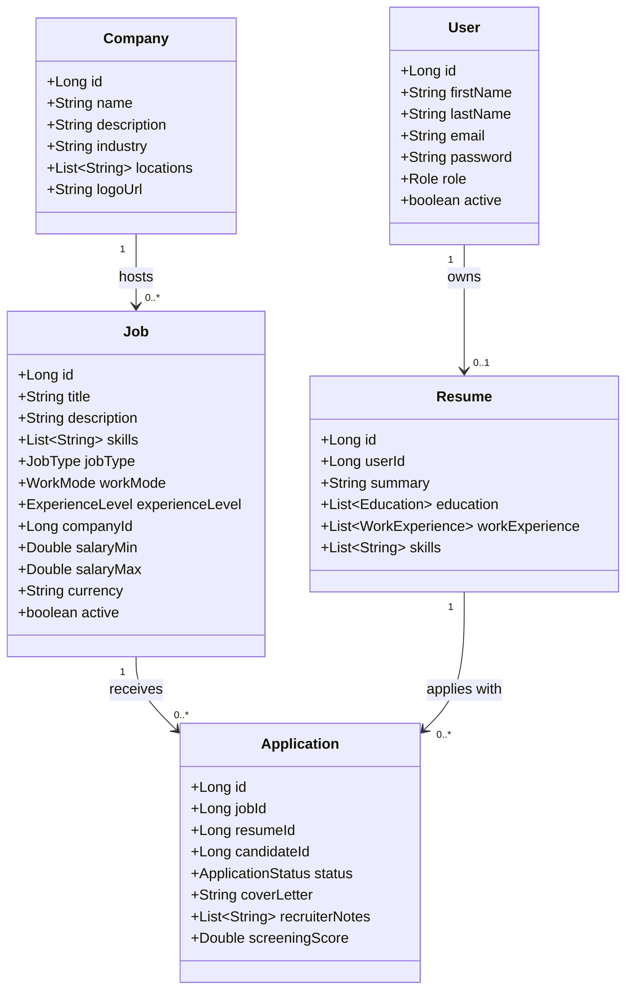
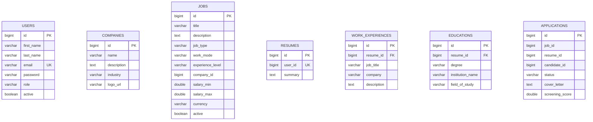
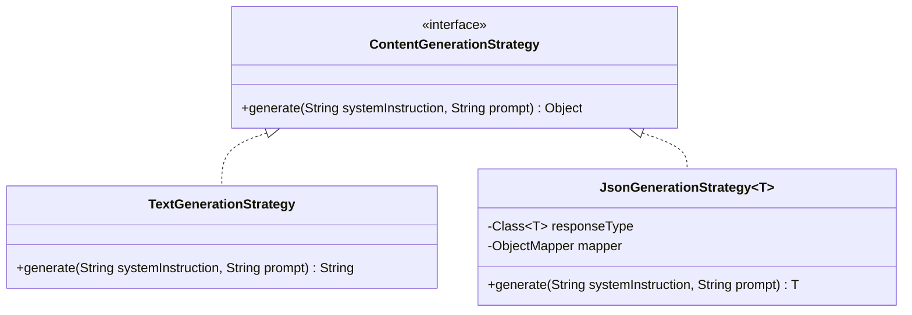
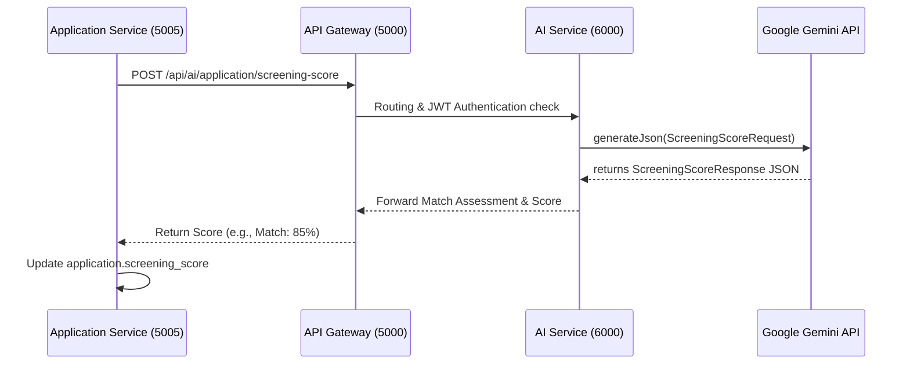
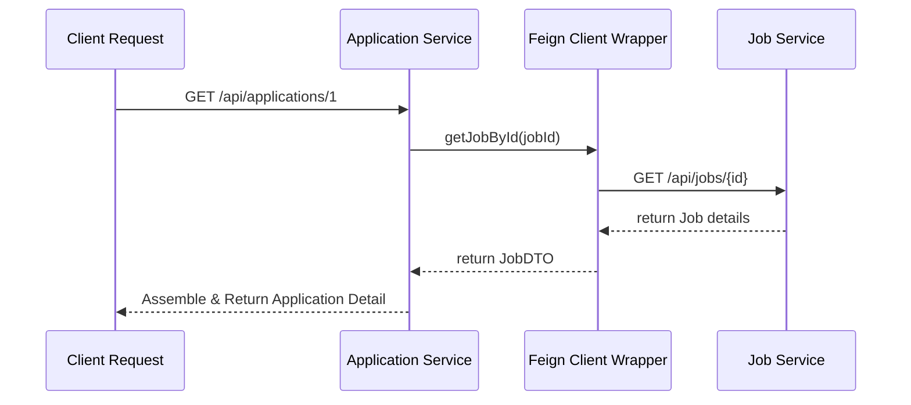

# Low-Level Design (LLD) — Job Portal System

This document outlines the detailed Low-Level Design (LLD) of the **Job Portal System**. It specifies the domain models, database schemas, design patterns, microservice interaction contracts, and core sequence flows.

---

## 1. Domain Models & Class Diagram

The system employs a decoupled domain model aligned to distinct microservices:



### Enums
* **`Role`**: `ROLE_CANDIDATE`, `ROLE_EMPLOYER`, `ROLE_ADMIN`
* **`JobType`**: `FULL_TIME`, `PART_TIME`, `CONTRACT`, `INTERNSHIP`, `FREELANCE`
* **`WorkMode`**: `REMOTE`, `HYBRID`, `ON_SITE`
* **`ExperienceLevel`**: `ENTRY`, `MID`, `SENIOR`, `LEAD`, `EXECUTIVE`
* **`ApplicationStatus`**: `APPLIED`, `SCREENING`, `INTERVIEWING`, `OFFERED`, `REJECTED`

---

## 2. Database Schema (Entity-Relationship Diagram)

Each microservice isolates its database schema to enforce datasource boundary security. Relations across databases are referenced logically by ID.



---

## 3. Design Patterns Applied

### A. Strategy Pattern (AI Output Strategy)
Used inside the `GeminiClient` to determine how models handle structuring responses (e.g., standard Markdown text vs structured JSON output).



### B. Builder Pattern (Fluent Request Payloads)
Applied across all response wrappers (e.g., `AiTextResponse`) to build payloads fluently.
```java
AiTextResponse response = AiTextResponse.builder()
        .content(rawText)
        .build();
```

### C. Observer Pattern (Async Notifications)
Recruiters and candidates are notified of status changes asynchronously (e.g., when a candidate gets a `ScreeningScore` computed, a notification event is emitted).

---

## 4. Microservice Sequence Flows

### Sequence A: Candidate Application Auto-Screening
Calculates candidate match compatibility using application-specific criteria.



### Sequence B: Declarative Inter-Service Fetching (OpenFeign)
Shows how OpenFeign abstracts inter-service synchronization.



---

## 5. API Interface Contracts

### A. AI Resume Controller (`/api/ai/resume`)
* **`POST /summary`**
  * **Request**: `ResumeSummaryRequest` (targetJobTitle, yearOfExperience, skills, workExperience, education)
  * **Response**: `AiTextResponse` (content)
* **`POST /experience-bullets`**
  * **Request**: `WorkExperienceBulletRequest` (jobTitle, company, rawDescription, achievementsHint)
  * **Response**: `WorkExperienceBulletsResponse` (bullets: List\<String\>)

### B. AI Job Controller (`/api/ai/job`)
* **`POST /describe`**
  * **Request**: `JobDescriptionRequest` (title, skill, experienceLevel, jobType, workMode, category, additionalContext)
  * **Response**: `AiTextResponse` (content)
* **`POST /salary-suggestion`**
  * **Request**: `SalaryRangeRequest` (title, skills, experienceLevel, jobType, location)
  * **Response**: `SalaryRangeResponse` (minSalary, maxSalary, currency, period, marketInsight)

### C. AI Application Controller (`/api/ai/application`)
* **`POST /screening-score`**
  * **Request**: `ScreeningScoreRequest` (jobTitle, experienceLevel, requiredSkills, responsibilities, candidateSummary, candidateSkills, candidateExperience, candidateEducation)
  * **Response**: `ScreeningScoreResponse` (score, skillsMatchScore, experienceMatchScore, educationMatchScore, matchedSkills, missingSkills, strengths, concerns, summary)

### D. AI Search Controller (`/api/ai/search`)
* **`POST /enhance`**
  * **Request**: `SearchEnhanceRequest` (query)
  * **Response**: `SearchEnhanceResponse` (keywords, locations, jobTypes, workModes, experienceLevels, minSalary, skills)
